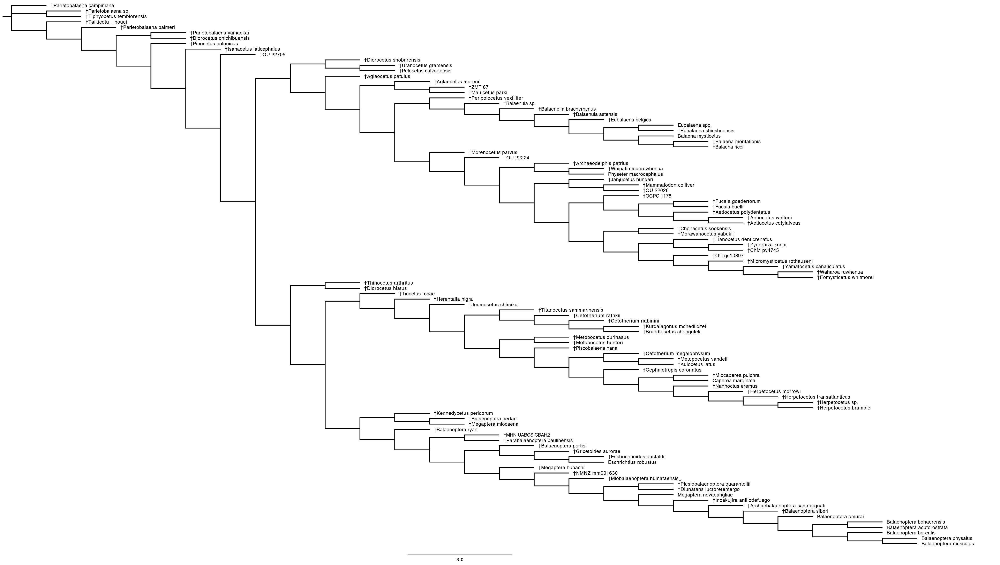

# Phylogenetic Biology - Final Project

## Guidelines - you can delete this section before submission

This repository is a stub for your final project. Fork it, develop your project, and submit it as a pull request. Edit/ delete the text in this readme as needed.

Some guidelines and tips:

- Use the stubs below to write up your final project. Alternatively, if you would like the writeup to be an executable document (with [knitr](http://yihui.name/knitr/), [jupytr](http://jupyter.org/), or other tools), you can create it as a separate file and put a link to it here in the readme.

- For information on formatting text files with markdown, see https://guides.github.com/features/mastering-markdown/ . You can use markdown to include images in this document by linking to files in the repository, eg ``.

- The project must be entirely reproducible. In addition to the results, the repository must include all the data (or links to data) and code needed to reproduce the results.

- If you are working with unpublished data that you would prefer not to publicly share at this time, please contact me to discuss options. In most cases, the data can be anonymized in a way that putting them in a public repo does not compromise your other goals.

- Paste references (including urls) into the reference section, and cite them with the general format (Smith at al. 2003).

- Commit and push often as you work.

OK, here we go.

# Title of my project

## Introduction and Goals

Balaenopteridae, or rorquals and humpback whales, is a superfamily within Cetacea that contains minke, blue, sei, Bryde's, fin, and humpback whales (McGowen et al., 2020). The family contains the largest animal to have ever lived (blue whales) and is extremely widespread, with members found in all major oceans. The earliest fossil records of this clade date back to the Miocene (~11.6–9.5 Mya), though the split between rorquals and the closely related grey whale, Eschrichtius robustus, is predicted to have occurred in the early-middle Miocene (~20-13 Mya) (Marx and Kohno, 2016; Tanaka and Watanabe, 2019). Balaenopteridae is perhaps most well-known for lunge feeding, a unique strategy in which the whale ‘lunges’ toward their microscope prey, swallowing up to 70,000 liters of water in the process (Pyenson et al., 2012). This feeding strategy has led to extremely specialized and derived morphology in this clade, including jaws that can open nearly 90 degrees and an oral cavity that can expand to four times its resting size (Pyenson et al., 2012). 

Though the transition of whales from their even-toed ungulate ancestors is largely well-understood, many questions regarding latter speciation events and the relationships between extant taxa remain unresolved. The inter-relationships between Delphinidae (the most speciose Cetacean family), for example, were largely problematic until recently (McGowen et al., 2020) and whether the pygmy right whale is the last living representative of Cetotheriidae is still a point of active research (Fordyce and Marx, 2013). Large strides have been made in resolving many of the relationships between Cetaceans and the origins of their extraordinary body plans (e.g. Lloyd et al., 2021; Mancia, 2018; McGowen et al., 2020), but much work is still to be done. For Balaenopteridae, further attention is required to elucidate the evolution of the clade’s more extreme features and relationships of taxa within, such as grey whales. In this study, we intend to further our understanding of the evolution of Balaenopteridae by making the first tip-dated time-calibrated phylogenetic tree of this clade. Tip-dating allows for fossilized taxa to be analyzed alongside living relatives by making use of stratigraphic, molecular, and morphological data matrices. This technique also frees internal nodes in the model from calibration priors or maximum age constraints (Luo et al., 2019). These models hold much promise but are also quite new, so this project is also intended to further explore the effects of tip-dating on phylogenetic inference. 

To reach this end, we intend to combine molecular data matrices for Balaenopteridae from data publicly available from recent phylogenies, including McGowen et al. (2020), with morphological data from Solis-Añorve et al. (2020). This morphological matrix includes both extinct and extant taxa and will be modified to also include the first and last occurrences in the fossil record. These matrices will then be analyzed using [BEAST2](https://www.beast2.org/) under a fossilized birth-death model. If time permits, these analyses will also be run using [RevBayes](https://revbayes.github.io/). Using [IQ-TREE](http://www.iqtree.org/), we also intend to construct initial parsimony and undated Bayesian trees to which to compare the results of the tip-dated tree.

## Methods

A publicly available matrix of cetacean morphological data was obtained from Solis-Añorve et al. (2020). This matrix includes 272 characters for 100 taxa, including 11 extant taxa consisting of all eight extant species of rorqual, sperm whales, right whales, and bowhead whales. Primary analysis of this matrix was then performed using [IQ-TREE](http://www.iqtree.org/) to build a maximum parsimony tree and maximum likelihood tree under a Jukes-Cantor-type model for morphological data. The best-fit model according to Bayesian information criterion (BIC) was ‘MK+FQ+ASC+R3’ model, a Jukes-Cantor type model with equal character rate frequencies, ascertainment bias correction, and a FreeRate gamma model with three rate categories. First and last fossil occurrence data were then found for all extinct taxa within the matrix and included in an updated NEXUS file. Last occurrence data were used for time-calibrating tips so as not to overestimate the amount of change. All references used to estimate occurrence data and the specific calibration dates can be found in [Supplementary Table 1](https://docs.google.com/spreadsheets/d/1y5EFwhsece4GBXPdpfWWFVy7wS1yI1QjBZOOTcmOETU/edit?usp=sharing). 

BEAUTi v2.6.7 was used to create XML input files for BEAST2 (v2.6.3) using the fossil-calibrated morphological matrix. XML inputs were configured to include tip-dating under a Random Local Clock model and run under the Fossilized Birth Death (FBD) model. The Random Local Clock Model assumes that each branch either inherits its parent's clock rate or evolves a new clock rate with a given probability. This allows for the direct test of a strict clock rate against many alternate clock rates (Drummond, 2010). The FBD model allows for the inclusion of all fossilized taxa and the calibration of extant and extinct taxa under the same macroevolutionary process (Heath et al., 2014). A gamma model was used for the distribution of rate priors, with α = 5.0 and β = 0.05. 

MCMC simulations were run with chain lengths of 107 iterations, with 10% burn-in periods of 106 iterations, storing every 5000. Three BEAST2 simulations were run with these specifications on Yale’s High Performance Computing cluster Farnam. All input and configuration files for these simulations are included in the supplementary information. The output log and .trees files were too large to include in this repository because of GitHub storage limits, but can be found in the [supplementary repository](https://drive.google.com/drive/folders/1AYV02CGQMamsj9nkxr4e0VuwfZJ6H9Qz?usp=sharing). Mixing and convergence of output files were analyzed using [Tracer v1.7.2](https://github.com/beast-dev/tracer/releases/tag/v1.7.2) and can be found in the [Supplementary repository](https://docs.google.com/document/d/163TUZ0qGjeJ-CCYUizhxZT0gGDOPOMmIllrMJOxFT-Y/edit?usp=sharing).  

Following the three MCMC simulations, the calculated posteriors were then combined using the BEAST2 ancillary package LogCombiner to couple a total of 270,001 trees (90,001 saved from each individual run). Finally, TreeAnnotator, another BEAST2 support package, was used to combine trees into a single Maximum Clade Credibility tree with node heights denoting median heights. [Figtree](http://tree.bio.ed.ac.uk/software/figtree/) was used to view and format the resulting combined trees. Further analysis of phylogenies was also performed using R packages [ape](http://ape-package.ird.fr/) and [phytools](https://github.com/liamrevell/phytools).  

## Results

 **Figure 1. Initial parsimony phylogram created with IQ-TREE. The scale bar below shows relative amounts of morphological character change.**

 **Figure 2. Maximum likelihood phylogram created with IQ-TREE. The tree was created using a ‘MK+FQ+ASC+R3’ model, a Jukes-Cantor type model with equal character rate frequencies, ascertainment bias correction, and a FreeRate gamma model with three rate categories. This model was selected as the highest likelihood using Bayesian information criterion (BIC). Bootstrap support values are included along nodes.** 

 **Figure 3. Maximum clade credibility phylogeny simulated with BEAST2. The colors of each branch show relative rates of morphological change over time. Blue bars over nodes indicate 95% confidence intervals for divergence times. The time scale at the bottom shows time before present, in millions of years.** 

 Figure 4. Lineages through time extracted from BEAST2 phylogeny. The x-axis shows time as millions of years before the present. The y-axis shows log(lineages) and has been log-transformed as lineage numbers are expected to change exponentially through time. 

## Discussion

These results indicate...

The biggest difficulty in implementing these analyses was...

If I did these analyses again, I would...

## References

- Bouckaert, R., Vaughan, T.G., Barido-Sottani, J., Duchêne, S., Fourment, M., Gavryushkina, A., Heled, J., Jones, G., Kühnert, D., De Maio, N., Matschiner, M., Mendes, F.K., Müller, N.F., Ogilvie, H.A., du Plessis, L., Popinga, A., Rambaut, A., Rasmussen, D., Siveroni, I., Suchard, M.A., Wu, C.-H., Xie, D., Zhang, C., Stadler, T., Drummond, A.J., 2019. BEAST 2.5: An advanced software platform for Bayesian evolutionary analysis. PLoS Comput Biol 15, e1006650. https://doi.org/10.1371/journal.pcbi.1006650
- Drummond, A.J., Suchard, M.A., 2010. Bayesian random local clocks, or one rate to rule them all. BMC Biol 8, 114. https://doi.org/10.1186/1741-7007-8-114
- Fordyce, R.E., Marx, F.G., 2013. The pygmy right whale Caperea marginata : the last of the cetotheres. Proc. R. Soc. B. 280, 20122645. https://doi.org/10.1098/rspb.2012.2645
- Heath, T.A., Huelsenbeck, J.P., Stadler, T., 2014. The fossilized birth–death process for coherent calibration of divergence-time estimates. Proc. Natl. Acad. Sci. U.S.A. 111. https://doi.org/10.1073/pnas.1319091111
- Lloyd, G.T., Slater, G.J., 2021. A Total-Group Phylogenetic Metatree for Cetacea and the Importance of Fossil Data in Diversification Analyses. Systematic Biology 70, 922–939. https://doi.org/10.1093/sysbio/syab002
- Luo, A., Duchêne, D.A., Zhang, C., Zhu, C.-D., Ho, S.Y.W., 2020. A Simulation-Based Evaluation of Tip-Dating Under the Fossilized Birth–Death Process. Systematic Biology 69, 325–344. https://doi.org/10.1093/sysbio/syz038
- Mancia, A., 2018. On the revolution of cetacean evolution. Marine Genomics 41, 1–5. https://doi.org/10.1016/j.margen.2018.08.004
- Marx, F.G., Kohno, N., 2016. A new Miocene baleen whale from the Peruvian desert. R. Soc. open sci. 3, 160542. https://doi.org/10.1098/rsos.160542
- McGowen, M.R., Tsagkogeorga, G., Álvarez-Carretero, S., dos Reis, M., Struebig, M., Deaville, R., Jepson, P.D., Jarman, S., Polanowski, A., Morin, P.A., Rossiter, S.J., 2020. Phylogenomic Resolution of the Cetacean Tree of Life Using Target Sequence Capture. Systematic Biology 69, 479–501. https://doi.org/10.1093/sysbio/syz068
- Minh, B.Q., Schmidt, H.A., Chernomor, O., Schrempf, D., Woodhams, M.D., von Haeseler, A., Lanfear, R., 2020. IQ-TREE 2: New Models and Efficient Methods for Phylogenetic Inference in the Genomic Era. Molecular Biology and Evolution 37, 1530–1534. https://doi.org/10.1093/molbev/msaa015
- Paradis, E., Schliep, K., 2019. ape 5.0: an environment for modern phylogenetics and evolutionary analyses in R. Bioinformatics 35, 526–528. https://doi.org/10.1093/bioinformatics/bty633
- Pyenson, N.D., Goldbogen, J.A., Vogl, A.W., Szathmary, G., Drake, R.L., Shadwick, R.E., 2012. Discovery of a sensory organ that coordinates lunge feeding in rorqual whales. Nature 485, 498–501. https://doi.org/10.1038/nature11135
- Revell, L.J., 2012. phytools: an R package for phylogenetic comparative biology (and other things): phytools: R package. Methods in Ecology and Evolution 3, 217–223. https://doi.org/10.1111/j.2041-210X.2011.00169.x
- Solis-Añorve, A., González-Barba, G., Hernández-Rivera, R., Schwennicke, T., 2021. Late Miocene balaenopterid (Cetacea:Mysticeti) from Baja California Sur, Mexico. Journal of South American Earth Sciences 111, 103498. https://doi.org/10.1016/j.jsames.2021.103498
- Tanaka, Y., Watanabe, M., 2019. An early and new member of Balaenopteridae from the upper Miocene of Hokkaido, Japan. Journal of Systematic Palaeontology 17, 1417–1431. https://doi.org/10.1080/14772019.2018.1532968

