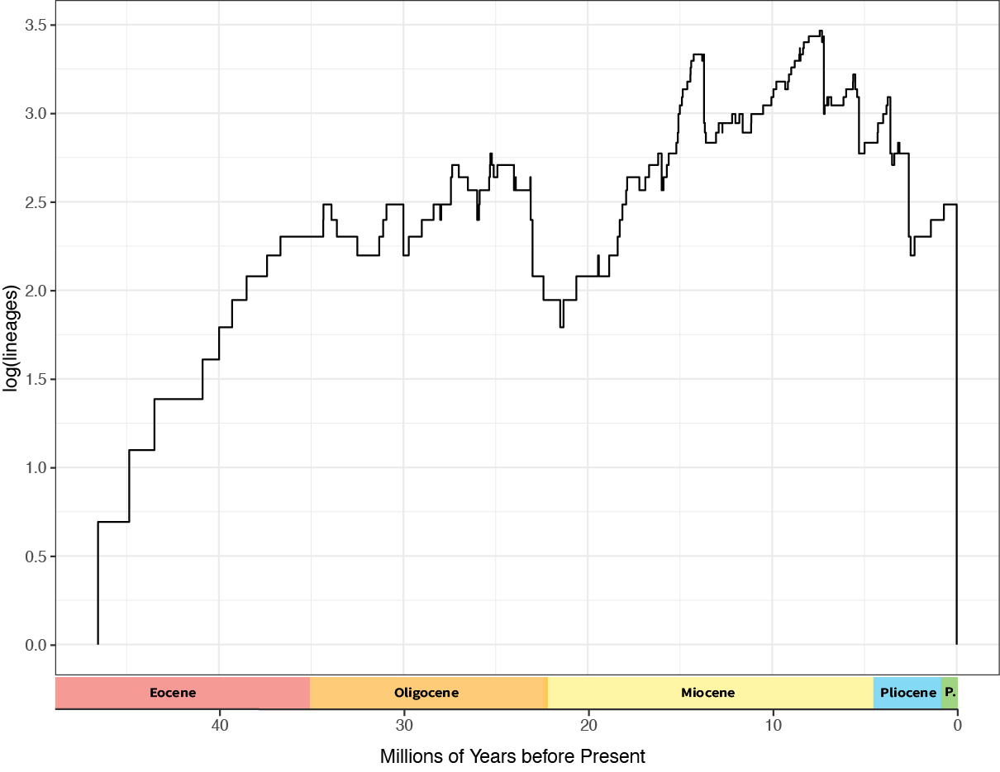

# Phylogenetic Biology - Final Project

# Time-Calibrated Phylogeny and Divergence Times of Balaenopteridae

## Introduction and Goals

Balaenopteridae, or rorquals and humpback whales, is a superfamily within Cetacea that contains minke, blue, sei, Bryde's, fin, and humpback whales (McGowen et al., 2020). The family contains the largest animal to have ever lived (blue whales) and is extremely widespread, with members found in all major oceans. The earliest fossil records of this clade date back to the Miocene (~11.6–9.5 Mya), though a number of fossils possibly in the family are from much earlier (Marx and Kohno, 2016; Tanaka and Watanabe, 2019). Balaenopteridae is perhaps most well-known for lunge feeding, a unique strategy in which the whale ‘lunges’ toward their microscope prey, swallowing up to 70,000 liters of water in the process (Pyenson et al., 2012). This feeding strategy has led to extremely specialized and derived morphology in this clade, including jaws that can open nearly 90 degrees and an oral cavity that can expand to four times its resting size (Pyenson et al., 2012). 

Though the transition of whales from their even-toed ungulate ancestors to modern aquatic body plans is largely well-understood, many questions regarding latter speciation events and the relationships between extant taxa remain unresolved. The inter-relationships between Delphinidae (the most speciose Cetacean family), for example, were largely problematic until recently (McGowen et al., 2020) and whether the pygmy right whale is the last living representative of Cetotheriidae is still a point of active research (Fordyce and Marx, 2013). Large strides have been made in resolving many of the relationships between Cetaceans and the origins of their extraordinary body plans (e.g. Lloyd et al., 2021; Mancia, 2018; McGowen et al., 2020), but much work is still to be done. For Balaenopteridae, further attention is required to elucidate the evolution of the clade’s more extreme features and relationships of taxa within, such as grey whales. In this study, we intend to further our understanding of the evolution of Balaenopteridae by making the first tip-dated time-calibrated phylogenetic tree of this clade. Tip-dating allows for fossilized taxa to be analyzed alongside living relatives by making use of stratigraphic, molecular, and morphological data matrices. This technique also frees internal nodes in the model from calibration priors or maximum age constraints (Luo et al., 2019). These models hold much promise but are also quite new, so this project is also intended to further explore the effects of tip-dating on phylogenetic inference. 

To reach this end, we intend to combine molecular data matrices for Balaenopteridae from data publicly available from recent phylogenies, including McGowen et al. (2020), with morphological data from Solis-Añorve et al. 2020. This morphological matrix includes both extinct and extant taxa and will be modified to also include occurrences in the fossil record. These matrices will then be analyzed using [BEAST2](https://www.beast2.org/) under a fossilized birth-death model. If time permits, these analyses will also be run using [RevBayes](https://revbayes.github.io/). Using [IQ-TREE](http://www.iqtree.org/), we also intend to construct initial parsimony and undated Bayesian trees to which to compare the results of the tip-dated tree.

## Methods

A publicly available matrix of cetacean morphological data was obtained from Solis-Añorve et al. (2020). This matrix includes 272 characters for 100 taxa, including 11 extant taxa consisting of eight extant species of rorqual, sperm whales, right whales, and bowhead whales. Primary analysis of this matrix was then performed using [IQ-TREE](http://www.iqtree.org/) to build a maximum parsimony tree and maximum likelihood tree for morphological data. The best-fit model according to Bayesian information criterion (BIC) was ‘MK+FQ+ASC+R3’ model, a Jukes-Cantor type model with equal character rate frequencies, ascertainment bias correction, and a FreeRate gamma model with three rate categories. First and last fossil occurrence data were then found for all extinct taxa within the matrix and included in an updated NEXUS file. Last occurrence data were used for time-calibrating tips so as not to overestimate the amount of change. All references used to estimate occurrence data and the specific calibration dates can be found in [Supplementary Table 1](https://docs.google.com/spreadsheets/d/1y5EFwhsece4GBXPdpfWWFVy7wS1yI1QjBZOOTcmOETU/edit?usp=sharing). 

***Table 1. Last occurrence dates and reference for all taxa used in Bayesian analysis***

| Taxon                            | Last Occurrance (Ma) | Reference                     |
| -------------------------------- | ---------------- | ----------------------------- |
| Zygorhiza kochii                 | 33.6             | Gingerich 2015                |
| Archaeodelphis patrius           | 26               | Geisler et al. 2011           |
| Waipatia maerewhenua             | 24               | Fordyce 1994                  |
| Aetiocetus cotylalveus           | 30               | Geisler et al. 2011           |
| Aetiocetus polydentatus          | 25.1             | Barnes et al. 1994            |
| Aetiocetus weltoni               | 28               | Deméré and Berta 2008         |
| Aglaocetus moreni                | 19.4             | Steeman 2009                  |
| Aglaocetus patulus               | 13.65            | Kellogg 1968                  |
| Aulocetus latus                  | 8.5              | Marx et al. 2016              |
| Balaena montalionis              | 2.6              | Capellini 1904                |
| Balaenella brachyrhynus          | 3.6              | Bisconti 2005                 |
| Balaenula astensis               | 2.6              | Trevisan 1942                 |
| Balaenula sp.                    | 3.5              | Tanaka et al. 2020            |
| Brandtocetus chongulek           | 12               | Gol'din and Startsev 2012     |
| Cephalotropis coronatus          | 7.2              | Cope 1896                     |
| Cetotherium riabinini            | 9.3              | Gol'din et al. 2020           |
| ChM pv4745                       | 30               | Geisler et al. 2011           |
| Chonecetus sookensis             | 23               | Russell 1968                  |
| Diorocetus chichibuensis         | 13.6             | Yoshida et al. 2003           |
| Diorocetus hiatus                | 13.8             | Kellogg 1968                  |
| Diorocetus shobarensis           | 16               | Otsuka and Ota 2008           |
| Eomysticetus whitmorei           | 23               | Sanders and Barnes 2002       |
| Eubalaena belgica                | 2.5              | Bisconti et al. 2017          |
| Eubalaena shinshuensis           | 5.4              | Bisconti et al. 2017          |
| Fucaia buelli                    | 30               | Mark et al. 2015              |
| Fucaia goedertorum               | 26               | Geisler et al. 2011           |
| Herentalia nigra                 | 7.3              | Bisconti 2014                 |
| Herpetocetus bramblei            | 5.3              | Whitemore and Barnes 2008     |
| Herpetocetus morrowi             | 3.1              | Adli et al. 2014              |
| Herpetocetus sp.                 | 6.8              | Tanaka and Watanabe 2018      |
| Cetotherium rathkii              | 12.7             | Brandt 1843                   |
| Isanacetus laticephalus          | 16               | Kimura and Ozawa 2002         |
| Janjucetus hunderi               | 24               | Fitzgerald 2006               |
| Joumocetus shimizui              | 7.2              | Kimura et al. 2010            |
| Kurdalagonus mchedlidzei         | 7.2              | Tarasenko and Lopatin 2012    |
| Llanocetus denticrenatus         | 33.9             | Fordyce and Mark 2018         |
| Mammalodon colliveri             | 23.9             | Fordyce and Mark 2016         |
| Mauicetus parki                  | 23.1             | Benham 1937                   |
| Metopocetus durinasus            | 11.6             | Cope 1896                     |
| Metopocetus vandelli             | 8.5              | Marx et al. 2016              |
| Micromysticetus rothauseni       | 23.1             | Rothausen 1971                |
| Herpetocetus transatlanticus     | 3.6              | Whitemore and Barnes 2008     |
| Miocaperea pulchra               | 7.2              | Bisconti 2012                 |
| Morawanocetus yabukii            | 23.1             | Barnes et al. 1995            |
| Morenocetus parvus               | 16               | Cabrera 1926                  |
| Nannocetus eremus                | 5.3              | Kellogg 1929                  |
| NMNZ mm001630                    | 7                | Mark and Fordyce 2015         |
| Metopocetus hunteri              | 7.2              | Marx et al. 2016              |
| OCPC 1178                        | 17.2             | Buono et al. 2017             |
| OU 22026                         | 27               | Fordyce and Marx 2016         |
| OU 22224                         | 26.5             | Marx and Fordyce 2015         |
| OU 22705                         | 21.5             | Marx and Fordyce 2015         |
| OU gs10897                       | 32.5             | Marx and Fordyce 2015         |
| Parietobalaena campiniana        | 13.7             | Bisconti et al. 2013          |
| Parietobalaena palmeri           | 13.7             | Kellogg 1924                  |
| Parietobalaena sp.               | 13.7             | Bisconti et al. 2013          |
| Parietobalaena yamaokai          | 13.7             | Otsuka and Ota 2008           |
| Peripolocetus vexillifer         | 13.7             | Kellogg 1931                  |
| Pinocetus polonicus              | 13.7             | Czyzewska and Ryziewicz 1976  |
| Piscobalaena nana                | 5.3              | Pilleri and Siber 1989        |
| Taikicetus inouei                | 11.6             | Tanaka et al. 2018            |
| Thinocetus arthritus             | 11.6             | Kellogg 1969                  |
| Tiphyocetus temblorensis         | 13.7             | Kellogg 1931                  |
| Titanocetus sammarinensis        | 13.7             | Capellini 1901                |
| Tiucetus rosae                   | 7.2              | Marx et al. 2017              |
| Waharoa ruwhenua                 | 25.2             | Boessenecker and Fordyce 2015 |
| Yamatocetus canaliculatus        | 23.3             | Okazaki 2012                  |
| ZMT 67                           | 22.4             | Tsai and Fordyce 2018         |
| Balaena ricei                    | 3.6              | Westage and Whitemore 2002    |
| Cetotherium megalophysum         | 7.2              | Cope 1895                     |
| Pelocetus calvertensis           | 13.7             | Kellogg 1965                  |
| Uranocetus gramensis             | 7.2              | Steeman 2009                  |
| Archaebalaenoptera castriarquati | 2.6              | Bisconti 2007                 |
| Balaenoptera bertae              | 2.6              | Boessenecker 2013             |
| Balaenoptera portisi             | 2.6              | Deméré et al. 2005            |
| Balaenoptera ryani               | 7.3              | Hanna and McLellan 1924       |
| Balaenoptera siberi              | 5.3              | Pilleri 1989                  |
| Diunatans luctoretemergo         | 3.6              | Bosselaers and Post 2010      |
| Eschrichtioides gastaldii        | 2.6              | Strobel 1881                  |
| Gricetoides aurorae              | 3.6              | Whitemore and Kaltenbach 2008 |
| Parabalaenoptera baulinensis     | 5.3              | Zeigler et al. 1997           |
| Plesiobalaenoptera quarantellii  | 7.2              | Bisconti 2010                 |
| Incakujira anillodefuego         | 7.2              | Marx and Kohno 2016           |
| MHN UABCS CBAH2                  | 5.5              | Solis-Añorve et al. 2021      |
| Megaptera hubachi                | 3.6              | Cope 1968                     |
| Miobalaenoptera numataensis      | 5.3              | Tanaka and Watanabe 2019      |
| Norrisanima miocaena             | 7.2              | Kellogg 1922                  |
| Kennedycetus pericorum           | 5.5              | Solis-Añorve et al. 2021      |

BEAUTi v2.6.7 was used to create XML input files for BEAST2 (v2.6.3) using the fossil-calibrated morphological matrix. XML inputs were configured to include tip-dating under a random local clock model and run under the Fossilized Birth Death (FBD) model. The random local clock model assumes that each branch either inherits its parent's clock rate or evolves a new clock rate with a given probability. This allows for the direct test of a strict clock rate against many alternate clock rates (Drummond, 2010). The FBD model allows for the inclusion of all fossilized taxa and the calibration of extant and extinct taxa under the same macroevolutionary process (Heath et al., 2014). A gamma model was used for the distribution of rate priors, with α = 5.0 and β = 0.05. 

MCMC simulations were run with chain lengths of 107 iterations, with 10% burn-in periods of 106 iterations, storing every 5000. Three BEAST2 simulations were run with these specifications on Yale’s High Performance Computing cluster Farnam. All input and configuration files for these simulations are included in the supplementary information. The output log and .trees files were too large to include in this repository because of GitHub storage limits, but can be found in the [supplementary repository](https://drive.google.com/drive/folders/1AYV02CGQMamsj9nkxr4e0VuwfZJ6H9Qz?usp=sharing). Mixing and convergence of output files were analyzed using [Tracer v1.7.2](https://github.com/beast-dev/tracer/releases/tag/v1.7.2) and can be found in the [Supplementary repository](https://docs.google.com/document/d/163TUZ0qGjeJ-CCYUizhxZT0gGDOPOMmIllrMJOxFT-Y/edit?usp=sharing).  

Following the three MCMC simulations, the calculated posteriors were then combined using the BEAST2 ancillary package LogCombiner to couple a total of 270,003 trees (90,001 saved from each individual run). Finally, TreeAnnotator, another BEAST2 support package, was used to combine trees into a single maximum clade credibility tree with node heights denoting median heights. [Figtree](http://tree.bio.ed.ac.uk/software/figtree/) was used to view and format the resulting combined trees. Further analysis of phylogenies, including calculation of lineages through time, was also performed using R packages [ape](http://ape-package.ird.fr/) and [phytools](https://github.com/liamrevell/phytools). 

In addition to tip-dating a variety of fossil specimens, an aim of this study was to recover relationships between extant taxa. However, a number of these relationships received low support under both maximum likelihood and Bayesian approaches when performed on the morphological data from Solis-Añorve et al. (2020). To better resolve a number of the relationships between extant taxa, two matrices of extant taxa were created from the aforementioned morphological matrix and a nucleotide matrix. The nucleotide matrix here drew from the enormous nucleotide matrix of all cetacea generated by McGowen et al. (2020). The genes selected were drawn from a set that included the top 1/3 of genes based on divergence between odontocetes and mysticetes. Regrettable, Omura’s whale (*Balaenoptera omurai*) had to be stripped from both matrices due to lack of suitable data, but the remainder of extant taxa from the morphological matrix were preserved. The final molecular matrix consisted of 10 taxa each with ~6 million nucleotide bases. Following collection, the nucleotide sequences were aligned using [MAFFT/7.475](https://mafft.cbrc.jp/alignment/software/source.html) on Yale’s Farnum cluster. Both matrices were then loaded into BEAUTi v2.6.7 and linked so as to generate a mixed data phylogeny. As all taxa are extant, a birth-death model was selected for the combined simulation. Priors for the morphological data were generated from a uniform distribution and run under a random local clock model. The parameters and model for the molecular matrix were estimated by running the molecular matrix through IQ-TREE. The model chosen was a general time reversible model with unequal rates, empirical base frequencies, and two rate categories. Specific parameters can be found in the XML configuration file in the supplement. Finally, the combined data input was run with BEAST2 twice and MCMC simulations were run with chain lengths of 107 iterations, with 10% burn-in periods of 106 iterations, storing every 5000. The outputs of these runs (a total of 180,001 trees) were combined and analyzed following the protocols described above. 

## Results

An initial parsimony tree was created from the morphological matrix using IQ-TREE (Figure 1). Though all members of *Balaenoptera* were found to form a clade, humpback whales (*Megaptera novaeangliae*) were recovered within the stem group. As might be expected, morphologically distinct grey whales (*Eschrichtius robustus*; Eschrichtiidae) were recovered further down the stem group, forming a clade with †*Eschrichtioides gastaldii*. Broad-scale topology of extant taxa was somewhat recovered, including the pygmy right whale (*Caperea marginata*) clade being sister to Balaenopteridae.  The clade (Balaenidae) containing bowhead whales (*Balaena mysticetus*) and right whales (*Eubalaena*) was, somewhat confoundingly, found to be sister to sperm whales (*Physeter macrocephalus*) though the ancestors of these taxa were known to have split over 39 million years ago (Coombs et al., 2020) and share little in common morphologically.  

**Figure 1. Initial parsimony phylogram created with IQ-TREE. The scale bar below shows relative amounts of morphological character change.** 

A second baseline comparative phylogeny was generated in IQ-TREE using a maximum likelihood with 1000 bootstrap replicates (Figure 2). The maximum likelihood and parsimony trees had 51 of 98 splits in common. Though no polytomies were found, the maximum likelihood approach also recovered a number of extremely short branches. Little to no morphological change was observed between taxa such as †*Mammalodon colliveri* and †*OU 22026* as well as the clade including †*Parietobalaena palmeri*, †*Parietobalaena sp*, †*Pinocetus polonicus*, and †*Tiphyocetus temblorensis*. These short branches were especially pronounced in the split between humpback and extant *Balaenoptera* and crown *Balaenoptera* with the clade containing †*Kennedycetus pericorum*. Slightly longer branches were recovered under the Bayesian approach and the implications for *Balaenoptera* radiation are discussed in further detail below. 

Notably, a number of the larger relationships remain unresolved under the maximum likelihood approach. Among the highest bootstrap support values (BS = 100) was that found for the split between the crown group consisting of Balaenidae, Balaenopteridae + Eschrichtiidae, and Cetotheriidae and the stem group Eomysticetidae, a relationship not unexpected due to the novel mandibular canal morphology found in the crown group that allows for lunge feeding (Boessenecker and Fordyce, 2014; Boessenecker and Fordyce, 2015). Other relationships, however, such as the split between Cetotheriidae and Balaenopteridae + Eschrichtiidae (BS = 59) or Eschrichtiidae and crown Balaenopteridae (BS = 65) presented low bootstrap values. Nevertheless, these results are not unexpected owing to a number of very similar morphologies in these clades and match similar support found in past studies (e.g. Marx et al., 2019).  

**Figure 2. Maximum likelihood phylogram created with IQ-TREE. The tree was created using a Jukes-Cantor type model with equal character rate frequencies, ascertainment bias correction, and a FreeRate gamma model with three rate categories. This model was selected as the highest likelihood using Bayesian information criterion (BIC). Bootstrap support values are included along nodes.** 

The three MCMC runs under a Bayesian approach showed similar convergence on posterior (mean -5888.75) and likelihood (mean -5612.33) values with good mixing throughout, though the first run showed somewhat higher values for both metrics ([Supplement A](https://docs.google.com/document/d/163TUZ0qGjeJ-CCYUizhxZT0gGDOPOMmIllrMJOxFT-Y/edit?usp=sharing)). Overall, the tip-dates estimated from fossil calibration appear to match previously recovered events quite well. We find the split between odontocetes and mysticetes at ~39 million years ago, matching past estimates from the literature (e.g. Coombs et al., 2020). The median age for the most recent common ancestor (MRCA) of Balaenopteridae and Neobalaenidae was estimated here to be slightly older (by ~3-5 million years) than previous time-calibrated molecular phylogenies such as Zurano et al. (2019) or McGowen et al. (2009), though this was still within the 95% confidence intervals of each other, and slightly younger than the split suggested by fossil evidence (Marx and Fordyce, 2015). The branching between right whales and bowhead whales matched previous molecular studies well (e.g. Lammer et al., 2019). The split with Balaenidae, however, was ~9 million years older than Zurano et al. (2019) and Lammers et al. (2019), though the posterior for this divergence was recovered with significant support (0.997). The MRCA of Balaenopteridae and Eschrichtiidae (12.698 MYA; mid-Miocene) appeared to split the difference between past analyses. Berta et al. (2016) recovered the MRCA at ~23 MYA while Zurano et al. (2019) and McGowan (2009) recovered the MRCA at ~7 MYA. It should be noted that the Berta et al. (2016) analysis was a consensus tree based on various morphological cladograms while Zurano et al. (2019) and McGowan (2009) used molecular data. As with the Balaenidae divergence, morphological analyses seem to recover older (and sometimes substantially older) divergence dates than molecular studies. The Balaenopteridae-Eschrichtiidae split might be especially susceptible to overestimated divergence times by morphological analysis as this split involves the transition from lateral suction filter feeding to engulfment/lunge feeding (Berta et al., 2016) and the myriad related innovations, including the development of the mandibular symphysis and cavum ventrale to extend engulfment range (Potvin et al., 2012). Conflicting topologies found by molecular and morphological methods (discussed below) might also lend to this confusion. It is inevitably hard to unpack the origins of such discrepancies in divergence time estimation, but these incongruences might be demonstrating how relatively smaller genomic mutations can have an outsized effect on morphology or how the assumed rates of mutation allowed for each species of data differ. Of course, these differences might also originate from the software or parameterizations used in each simulation, and unpacking these differences is grounds for further work. 

An important result of this reconstruction is the relative rates of mutation, shown by the branch colors in Figure 3. Mutation rates are relatively slow within odontocetes and basal mysticetes but accelerate quite rapidly in the early Oligocene (38.5 Ma) with the development of the mysticete body plan. Mutation rates then stay high until the present day, with the exception of a few taxa such as †*Joumocetus shimizui* or †*Tiucetus rosae*. An important factor in this acceleration may be the major innovation in the head shape of Mysteceti that occurred following the late-Eocene split and the many related morphological changes, including a broad supraorbital process, an enlarged pars cochlearis directed towards the skull, and a triangular periosteal anterior process (Deméré et al., 2005; Solis-Añorve et al., 2021). These changes in head shape in rorquals and Cetotheriidae are likewise inextricably linked with a number of pulses related to gigantism. Unpacking the forces behind these body plan alterations and the interactive relationship between morphology and behavior (lunge feeding for example) is still an open field of study, but current theories put forth late-Neogene ocean-climate dynamics, including cooling temperatures and diatom expansion (Slater et al., 2017). Regardless of the driver, for much of the history recovered here, these high relative rates are concurrent with rapid radiation, especially during the Miocene. Though all the exceptionally short branches, verging on polytomy, recovered from the maximum likelihood approach were expanded significantly (e.g. the Parietobalaena clade), short branches and rapid divergence are maintained throughout this latter period. This trend can be seen more explicitly in Figure 4.  

**Figure 3. Maximum clade credibility phylogeny simulated with BEAST2. The colors of each branch show relative rates of morphological change over time. Blue bars over nodes indicate 95% confidence intervals for divergence times. The time scale at the bottom shows time before the present, in millions of years.** 

 **Figure 4. Lineages through time extracted from BEAST2 phylogeny. The x-axis shows time as millions of years before the present. The y-axis shows log(lineages) and has been log-transformed as lineage numbers are expected to change exponentially through time.**  

This presentation of lineages through time shows a notable downturn in lineages across the Oligocene-Miocene boundary. Extant lineages increase steadily from the earliest sampled fossil in the Eocene to the mid-late-Oligocene, after which there is a notable drop. One possibility is a significant decline in whale diversity through this period, reaching a local minimum at the Oligocene-Miocene boundary. Indeed, past studies have shown that there was likely a decrease in the diversity of cetacea from the mid- to late-Oligocene (Fordyce, 1980) corresponding to the timeframe given here. This seems unlikely, however, for a number of reasons. We know that the Eocene-Oligocene boundary was a period of climate change that marked a great overturning in cetaceans from the primitive, terrestrial body plan to that of modern whales (Fordyce, 1981). Though lineages in Figure 4 do seem to stagnate around this period (which actually might be reflecting this overturning) there is not a drop in diversity even marginally as big as that through the Oligocene-Miocene boundary. It is more likely, then, that this period is reflective of a large fossil gap. This can also be observed in the number of terminal nodes of the phylogeny: the number of fossil taxa sampled on either side of this boundary is quite high but with very few in between. Further sampling is needed to get a more complete picture of diversity over time.

There were a number of points at which the relationships between extant species in the phylogeny generated from morphological data (Figure 3) differed from molecular studies (e.g. Zurano et al., 2019; McGowan et al., 2020). In our results, grey whales (*Eschrichtius robustus*) were found to have diverged first, followed by humpback whales. Nevertheless, these were not strong results—the posterior probabilities for these splits were 0.5644 and 0.4329, respectively. The mixed-data phylogeny shown in Figure 5 helps to clarify the strength of the morphological effect on the uncertainties of this topology. When molecular data was included in the inference, relationships were recovered with significant support (100% for all nodes shown).  

 **Figure 5. Phylogeny of extant taxa from combined morphological and molecular data. Bayesian posterior support values are shown at the nodes.** 

Under this model, the minke whale clade was found to diverge first, followed by a fin whale-humpback whale clade. Grey whales, notably, were recovered in the middle of the crown group rather than on the stem. Grey whales have largely been considered as distinct from the members of Balaenopteridae and have only recently begun to be placed within the clade as molecular support for the position grows. This placement recovered here raises a number of interesting points. First is that with grey whales within the crown group, Balaenopteridae would be paraphyletic. Though this result is not too surprising—Balaenopteridae as a taxonomic classification has been described a grouping based on feeding strategy (McGowan et al., 2009)—it suggests (once again) that taxonomic classification is not synonymous with phylogenetic history and that taxonomic category is not synapomorphy. The close association between morphology and taxonomy can be seen even more explicitly when comparing the mixed-data analysis (Figure 5) with the morphological chronogram (Figure 3). It seems no coincidence that grey whales ( *Eschrichtius robustus*) and humpback whales (*Megaptera novaeangliae*), which are recovered within crown Balaenopteridae under molecular phylogenies (e.g. McGowan et al., 2009; McGowan et al., 2020; Zurano et al., 2019) but are the first to diverge under morphological simulation (results here; Berta et al., 2016;  Boessenecker and Fordyce, 2015), are the two species named with different genera. This placement of grey whales also suggests something interesting about feeding strategy evolution. Following Berta et al. (2016), surface filter feeding was the ancestral trait while lunge feeding, a strategy carried out by balaenopterids ranging from minke whales to blue whales, later evolved in this clade. The analysis here suggests that lunge feeding and the related morphologies were secondarily lost within grey whales (or more unlikely that it evolved three times within the clade) and that new specialized features for suction filter feeding evolved in the taxon in place. 

## Discussion

The first thing that these results indicated was that the important divergence dates between clades—between odontoceti and mysticeti or Balaenopteridae and Neobalaenidae, for example—are well supported across inference methods. Inference from fossil stratigraphy has long-established broad periods for these radiations. More recently, molecular-clock-based methods come to similar conclusions based on estimated mutation rates of biomolecules. Our work here has shown that combining morphology with occurrence data can further corroborate these divergence-time estimates despite operating on a separate category of data, bolstering confidence in previous divergence estimates and the accuracy of phylogenetic methods. 

Importantly, these phylogenies suggest some key points about the evolution of the balaenopterid body plan. As suggested by Figures 3 and 4, rates of morphological evolution were quite high following the split with odontoceti and found their climax during the mid-Miocene. A possibility then is that the prevailing gigantism across the clade and the related distinct morphologies were not the result of isolated populations undergoing continually more extreme evolutionary changes, but a process that involved parallel courses of trial and error. This might be interpreted as an adaptive radiation that occurred as a result of the early innovations in mysticete morphology, and especially the inception of lunge feeding in Balaenopteridae. Of course, this might also have been a result of abiotic drivers, such as an evolving climate and ocean environment to which these evolving cetacean clades were adapting whether because of ecological opportunity or selective pressures. With that in mind, there is still quite a large fossil gap across the Oligocene-Miocene boundary that might also be affecting these conclusions, possibly impacting the calculations of both the slope of and relative lineages. Though the morphological matrix used here was nearly comprehensive in its consideration of fossilized taxa, further work should involve the inclusion of any missing members and updated simulations as new fossils are uncovered. 

Finally, the results point to an important role for morphology in phylogenetics even as molecular data becomes the dominant character type. As noted above, the mixed-data analysis yielded a topology with strong Bayesian posterior support. Notably, this topology included a strongly supported placement of grey whales centrally within crown Balaenopteridae, whereas past molecular studies, which often find grey whales to have diverged after minke whales, recover this location with very low support (Hassanin et al., 2012; Árnason et al., 2018; McGowan et al., 2020). Further still, the placement of grey whales here had no effect on the relative location of other taxa when compared to purely molecular methods. This result is interesting because various other relationships were recovered in the purely morphological analysis, but it was only the one (grey whales) that was uncertain under purely molecular analysis that was found to differ from these latter analyses. Regardless of which topology is the correct one, these results point to the inclusion of morphological data as being a useful method to find support when topology is precarious while having little effect on nodes well-supported by molecular data. 

The biggest difficulties in implementing these analyses were the parameterization of the Bayesian runs and the alignment required for the mixed-data runs. Initially, I intended to use full genomes but this resulted in a number of complications. Full genomes have not been sequenced for all taxa here and for those taxa for which they had been sequenced, the computational requirements to align and process this quantity of bases would have been quite high, even on the cluster. I ended up using a dataset from McGowan et al. (2020) that included the top 1/3 of genes in terms of odontocete-mysticete divergence, allowing for a dataset that was ~6 Mbp long instead of ~2Gbp. Even this length of nucleotides took ~2 days to align using MAFFT. Though this was justified for the extent of this project and has been justified by McGowan et al. (2020), trimming the genome in this fashion might have added certain information that would not necessarily be present in the full genomes, thereby conflicting with the phylogenetic analysis. Further work would include many more bases if possible, as well as also considering the gene fragments from Omura’s whale that were too short and dispersed for this study but would be informative for future work. 

The parameterization for Bayesian runs in this study was largely a mix of trial and error and logistical concessions. A number of preliminary runs comparing a random local clock against a strict clock suggested that the strict clock would be insufficient to model the multivariate changes occurring, based on branch lengths, mutation rates, and likelihood. Thus a random local clock was chosen as the better of these two options. These runs, however, used ~1 week of computational time on Yale’s Farnam cluster. Further work should include additional simulations under a relaxed local clock model to compare how the additional variation permitted by this model changes the results here. A gamma distribution was chosen from which to draw priors, as these are suitable for fossil-constrained processes on scalar variables (Heath, 2015), though the results from using a gamma prior distribution did not differ significantly from using a uniform distribution in our preliminary comparisons here. Further work should include simulation under log-normal and exponential distributions to see if the results differ significantly. In this further work, I would also like to learn more about how to assess the suitability of various clock models and prior distributions beyond completing a set of simulations on the full dataset each time, which is both logistically complicated and time-consuming. This work might simply involve more experience with parameter selection or creating a model dataset to allow for easier simulation of the data in question here.  

Finally, I would like to further explore the mechanisms behind the flux of morphological innovation concurrent with the rapid radiation of Mysticete lineages, including the relative contributions of adaptive radiation and abiotic drivers. This might involve rerunning the simulations here under an adaptive radiation model, perhaps comparing morphological aspects, such as the match of physiology with ecological niche, with the tempo of diversification. These results could then be compared with models that take into account climatic changes and related food-web turnovers (e.g. the impacts of the PETM). I would also like to include phylogenetic principal components analysis (pPCA) so as to not only investigate the tempos of gross morphological change as done here, but also the specific components involved. 

## References

1. Árnason, Ú., Lammers, F., Kumar, V., Nilsson, M.A., Janke, A., 2018. Whole-genome sequencing of the blue whale and other rorquals finds signatures for introgressive gene flow. Science Advances 4, eaap9873. https://doi.org/10.1126/sciadv.aap9873

2. Berta, A., Lanzetti, A., Ekdale, E.G., Deméré, T.A., 2016. From Teeth to Baleen and Raptorial to Bulk Filter Feeding in Mysticete Cetaceans: The Role of Paleontological, Genetic, and Geochemical Data in Feeding Evolution and Ecology. Integrative and Comparative Biology 56, 1271–1284. https://doi.org/10.1093/icb/icw128

3. Boessenecker, R.W., Fordyce, R.E., 2015a. A new Eomysticetid (Mammalia: Cetacea) from the Late Oligocene of New Zealand and a re-evaluation of ‘ Mauicetus ’ waitakiensis. Papers in Palaeontology 1, 107–140. https://doi.org/10.1002/spp2.1005

4. Boessenecker, R.W., Fordyce, R.E., 2015b. A new genus and species of eomysticetid (Cetacea: Mysticeti) and a reinterpretation of ‘ M auicetus ’ lophocephalus Marples, 1956: Transitional baleen whales from the upper Oligocene of New Zealand: Oligocene Eomysticetid From New Zealand. Zool J Linn Soc 175, 607–660. https://doi.org/10.1111/zoj.12297

5. Bouckaert, R., Vaughan, T.G., Barido-Sottani, J., Duchêne, S., Fourment, M., Gavryushkina, A., Heled, J., Jones, G., Kühnert, D., De Maio, N., Matschiner, M., Mendes, F.K., Müller, N.F., Ogilvie, H.A., du Plessis, L., Popinga, A., Rambaut, A., Rasmussen, D., Siveroni, I., Suchard, M.A., Wu, C.-H., Xie, D., Zhang, C., Stadler, T., Drummond, A.J., 2019. BEAST 2.5: An advanced software platform for Bayesian evolutionary analysis. PLoS Comput Biol 15, e1006650. https://doi.org/10.1371/journal.pcbi.1006650

6. Coombs, E.J., Clavel, J., Park, T., Churchill, M., Goswami, A., 2020. Wonky whales: the evolution of cranial asymmetry in cetaceans. BMC Biol 18, 86. https://doi.org/10.1186/s12915-020-00805-4

7. Deméré, T.A., Berta, A., McGowen, M.R., 2005. The Taxonomic and Evolutionary History of Fossil and Modern Balaenopteroid Mysticetes. J Mammal Evol 12, 99–143. https://doi.org/10.1007/s10914-005-6944-3

8. Drummond, A.J., Suchard, M.A., 2010. Bayesian random local clocks, or one rate to rule them all. BMC Biol 8, 114. https://doi.org/10.1186/1741-7007-8-114

9. Fordyce, R.E., 1992. 18. Cetacean Evolution and Eocene/Oligocene Environments, in: Prothero, D.R., Berggren, W.A. (Eds.), Eocene-Oligocene Climatic and Biotic Evolution. Princeton University Press, pp. 368–381. https://doi.org/10.1515/9781400862924.368

10. Fordyce, R.E., 1980. Whale evolution and Oligocene southern ocean environments. Palaeogeography, Palaeoclimatology, Palaeoecology 31, 319–336. https://doi.org/10.1016/0031-0182(80)90024-3

11. Fordyce, R.E., Marx, F.G., 2013. The pygmy right whale Caperea marginata : the last of the cetotheres. Proc. R. Soc. B. 280, 20122645. https://doi.org/10.1098/rspb.2012.2645

12. Hassanin, A., Delsuc, F., Ropiquet, A., Hammer, C., Jansen van Vuuren, B., Matthee, C., Ruiz-Garcia, M., Catzeflis, F., Areskoug, V., Nguyen, T.T., Couloux, A., 2012. Pattern and timing of diversification of Cetartiodactyla (Mammalia, Laurasiatheria), as revealed by a comprehensive analysis of mitochondrial genomes. Comptes Rendus Biologies 335, 32–50. https://doi.org/10.1016/j.crvi.2011.11.002

13. Heath, T.A., 2015. Divergence time estimation using BEAST v2. Dating species divergences with the fossilized birth-death process.
Heath, T.A., Huelsenbeck, J.P., Stadler, T., 2014. The fossilized birth–death process for coherent calibration of divergence-time estimates. Proc. Natl. Acad. Sci. U.S.A. 111. https://doi.org/10.1073/pnas.1319091111

14. Katoh, K., Standley, D.M., 2013. MAFFT Multiple Sequence Alignment Software Version 7: Improvements in Performance and Usability. Molecular Biology and Evolution 30, 772–780. https://doi.org/10.1093/molbev/mst010

15. Lammers, F., Blumer, M., Rücklé, C., Nilsson, M.A., 2019. Retrophylogenomics in rorquals indicate large ancestral population sizes and a rapid radiation. Mobile DNA 10, 5. https://doi.org/10.1186/s13100-018-0143-2

16. Lloyd, G.T., Slater, G.J., 2021. A Total-Group Phylogenetic Metatree for Cetacea and the Importance of Fossil Data in Diversification Analyses. Systematic Biology 70, 922–939. https://doi.org/10.1093/sysbio/syab002

17. Luo, A., Duchêne, D.A., Zhang, C., Zhu, C.-D., Ho, S.Y.W., 2020. A Simulation-Based Evaluation of Tip-Dating Under the Fossilized Birth–Death Process. Systematic Biology 69, 325–344. https://doi.org/10.1093/sysbio/syz038

18. Mancia, A., 2018. On the revolution of cetacean evolution. Marine Genomics 41, 1–5. https://doi.org/10.1016/j.margen.2018.08.004

19. Marx, F.G., Fordyce, R.E., 2015. Baleen boom and bust: a synthesis of mysticete phylogeny, diversity and disparity. R. Soc. open sci. 2, 140434. https://doi.org/10.1098/rsos.140434

20. Marx, F.G., Kohno, N., 2016. A new Miocene baleen whale from the Peruvian desert. R. Soc. open sci. 3, 160542. https://doi.org/10.1098/rsos.160542

21. Marx, F.G., Post, K., Bosselaers, M., Munsterman, D.K., 2019. A large Late Miocene cetotheriid (Cetacea, Mysticeti) from the Netherlands clarifies the status of Tranatocetidae. PeerJ 7, e6426. https://doi.org/10.7717/peerj.6426

22. McGowen, M.R., Spaulding, M., Gatesy, J., 2009. Divergence date estimation and a comprehensive molecular tree of extant cetaceans. Molecular Phylogenetics and Evolution 53, 891–906. https://doi.org/10.1016/j.ympev.2009.08.018

23. McGowen, M.R., Tsagkogeorga, G., Álvarez-Carretero, S., dos Reis, M., Struebig, M., Deaville, R., Jepson, P.D., Jarman, S., Polanowski, A., Morin, P.A., Rossiter, S.J., 2020. Phylogenomic Resolution of the Cetacean Tree of Life Using Target Sequence Capture. Systematic Biology 69, 479–501. https://doi.org/10.1093/sysbio/syz068

24. Minh, B.Q., Schmidt, H.A., Chernomor, O., Schrempf, D., Woodhams, M.D., von Haeseler, A., Lanfear, R., 2020. IQ-TREE 2: New Models and Efficient Methods for Phylogenetic Inference in the Genomic Era. Molecular Biology and Evolution 37, 1530–1534. https://doi.org/10.1093/molbev/msaa015

25. Paradis, E., Schliep, K., 2019. ape 5.0: an environment for modern phylogenetics and evolutionary analyses in R. Bioinformatics 35, 526–528. https://doi.org/10.1093/bioinformatics/bty633

26. Pyenson, N.D., Goldbogen, J.A., Vogl, A.W., Szathmary, G., Drake, R.L., Shadwick, R.E., 2012. Discovery of a sensory organ that coordinates lunge feeding in rorqual whales. Nature 485, 498–501. https://doi.org/10.1038/nature11135

27. Revell, L.J., 2012. phytools: an R package for phylogenetic comparative biology (and other things): phytools: R package. Methods in Ecology and Evolution 3, 217–223. https://doi.org/10.1111/j.2041-210X.2011.00169.x

28. Slater, G.J., Goldbogen, J.A., Pyenson, N.D., 2017. Independent evolution of baleen whale gigantism linked to Plio-Pleistocene ocean dynamics. Proc. R. Soc. B. 284, 20170546. https://doi.org/10.1098/rspb.2017.0546

29. Solis-Añorve, A., González-Barba, G., Hernández-Rivera, R., Schwennicke, T., 2021. Late Miocene balaenopterid (Cetacea:Mysticeti) from Baja California Sur, Mexico. Journal of South American Earth Sciences 111, 103498. https://doi.org/10.1016/j.jsames.2021.103498

30. Tanaka, Y., Watanabe, M., 2019. An early and new member of Balaenopteridae from the upper Miocene of Hokkaido, Japan. Journal of Systematic Palaeontology 17, 1417–1431. https://doi.org/10.1080/14772019.2018.1532968

31. Zurano, J.P., Magalhães, F.M., Asato, A.E., Silva, G., Bidau, C.J., Mesquita, D.O., Costa, G.C., 2019. Cetartiodactyla: Updating a time-calibrated molecular phylogeny. Molecular Phylogenetics and Evolution 133, 256–262. https://doi.org/10.1016/j.ympev.2018.12.015

